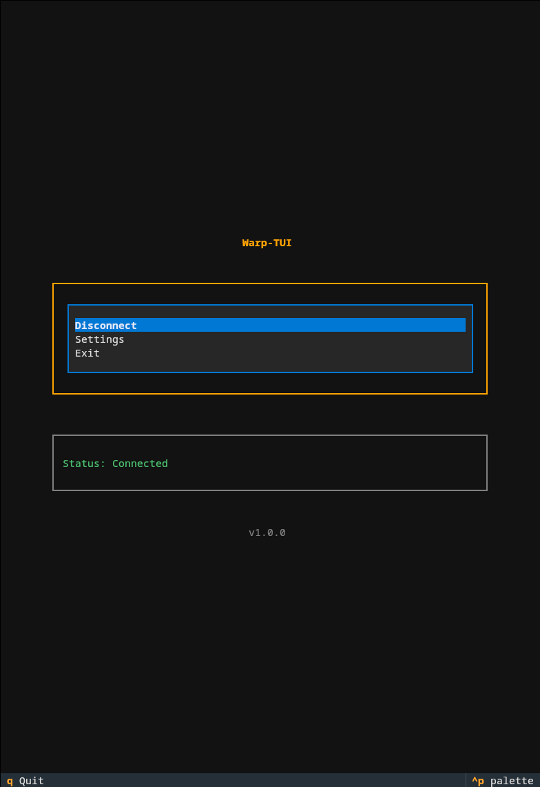

# warp-tui

A terminal user interface frontend for managing Cloudflare Warp (warp-cli) connections on Linux.



## Requirements

- Linux system
  - Tested and developed on Fedora 43, your experience may differ
- [warp-cli](https://developers.cloudflare.com/warp-client/get-started/linux/)
- Python 3.14 or higher (if running from source)

## Installation

### Option 1: Download Binary (Recommended)

Download the latest release [here](https://github.com/junyali/warp-tui/releases/latest) and install:

```console
$ wget https://github.com/junyali/warp-tui/releases/latest/download/warp-tui
$ sudo install -m 755 warp-tui /usr/local/bin
```

### Option 2: Build from Source

Clone the repository and install dependencies:

```console
$ git clone https://github.com/junyali/warp-tui.git
$ cd warp-tui
$ pip install -r requirements.txt
```

Build the binary with Pyinstaller

```console
$ pyinstaller warp-tui.spec
```

The binary will be in the `dist/` directory. Install it:

```console
$ sudo install -m 755 warp-tui /usr/local/bin
```

## Usage

Just run:

```console
$ warp-tui
```

**⚠️ Warning: First time users of warp-cli MUST register their device with Cloudflare WARP. You can do so by running the following command:**
```console
$ warp-cli registration new
```

and verify it has registered successfully:

```console
$ warp-cli registration status
```

## Navigation
- Use arrow keys just like any other TUI to navigate menus
- Press Enter to select an option
- Press Escape to go back
- Press 'q' to quit

## Features (so far...)
- Connect and disconnect from WARP
- View connection status through polling
- Change WARP mode (warp, doh, warp+doh, dot, warp+dot, proxy, tunnel_only)
- Configure proxy port (when using proxy mode)
